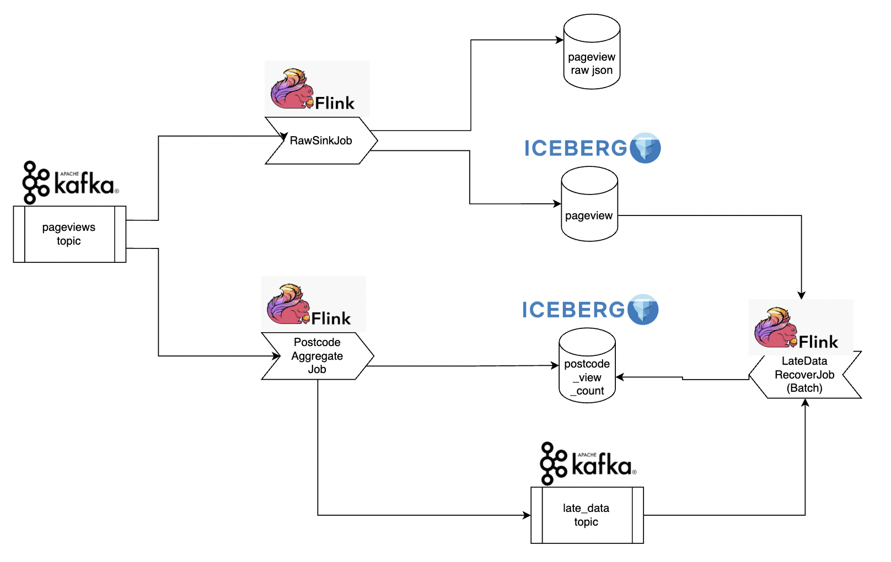
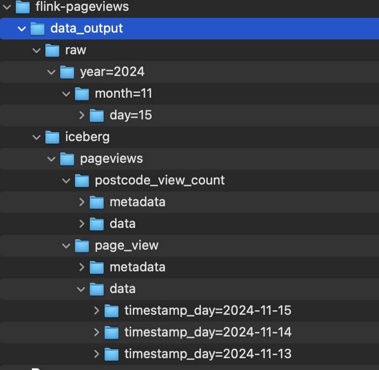

# flink-pageviews

Flink-pageviews is a Flink application that reads pageview events from a Kafka topic, count number of views per 
postcode each minute and sink to Iceberg table on S3.

Example pageview event is as follow.
```json
{
  "user_id": 1234, 
  "postcode": "SW19", 
  "webpage": "www.website.com/index.html", 
  "timestamp": 1611662684
}
```




## Components

The application contains the following components:

- Input:
  - A kafka topic called `pageviews` hosting pageviews event
  - A Flink Job called DataGenerator sending fake data into `pageviews` topic with rate 10 RPS. To simulate late 
    data behavior, 80% of events send by this job can have late arrival up to 20 seconds, 10% of events can be late 
    for 1 day and 10% of events can be late for 2 days.
- Pipelines:
  - A Flink job called RawSink reads pageview from Kafka and sink the events in 2 formats (json and iceberg table) 
    without transformation
  - A Flink job called PostcodeAggregateJob reads pageview from Kafka, aggregate and count views by postcode each 
    minute and sink results to an Iceberg table. Late data from this job is sinked to another topic on Kafka
- Outputs:
  - Raw events in original format (json) and an iceberg table
  - Aggregated view count by postcode stored in an upsert iceberg table, primary keys are `postcode,timestamp`
  - A kafka topic storing dropped late events of the PostcodeAggregateJob
- [Tentative]: the raw events in iceberg table is planned to be used for a Flink job to backfill and recalculate 
  counts of late events windows but I haven't had time to implemented yet.

## How to run

### Prerequisites

- Install Docker & docker-compose 
- Build docker image with command
```shell
docker build -t flink-pageviews .
```
- Create a folder called `data_output` to store the output result of pipeline
```shell
mkdir data_output
```
- Deploy with docker-compose, startup, all components including Kafka, data generator and flink jobs will start to run

```shell
docker-compose up
```

### Verify results

- The following urls can be used to verify the status of pipelines and data on kafka
  - `http://localhost:8081`: Flink UI for DataGeneratorJob 
  - `http://localhost:8082`: Flink UI for RawSinkJob 
  - `http://localhost:8083`: Flink UI for PostcodeAggregateJob 
  - `http://localhost:8080`: AKHQ, a Kafka UI tool to view kafka topic contents

- Data results can access from the `data_output` created previously

